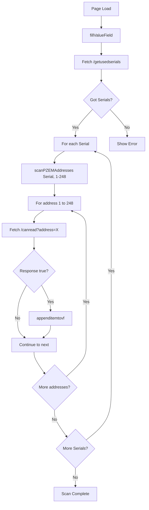

# PZEM Search Page Transformation Plan

## Overview
Transform the current temperature sensor inventory page ([`wifi_PZEM.html`](spiffs/wifi_PZEM.html:1)) into a PZEM device search and configuration interface.

## Current Functionality Analysis

### Existing Structure
- Title: "Temperature Sensor Inventory"
- Displays temperature sensors in a value-field container with class="item" rows
- Three main data sources:
  - Known sensors (from `sensnames.json`)
  - Unknown sensors (from `getunknownsenses.json`)
  - Live sensors (from `/getlivesensors`)

### Key Functions to Replace
1. **fillKnownSensors()** - Fetches and displays known temperature sensors
2. **fillUnknownSensors()** - Fetches and displays unknown temperature sensors
3. **fillLiveSensors()** - Updates live status indicators
4. **fillValueField()** - Orchestrates all three functions above
5. **rescanhWireButtonClick()** - Triggers rescan via `/rescanwires/`

### Functions to Keep
1. **appenditemtovf(ser, name)** - Creates item rows (needs modification)
2. **clickDelete(id)** - Handles row deletion
3. DOM event listeners and form structure

---

## New Functionality Design

### Backend API Assumptions
Based on the task requirements, the following endpoints need to exist:

#### 1. `/getusedserials` Endpoint
**Purpose:** Returns information about hardware serials configured for PZEM devices

**Expected Response Format:**
```json
[
  {
    "serialName": "Serial1",
    "rxPin": 16,
    "txPin": 17
  }
]
```

**Note:** Since the current code shows only Serial1 is configured, this will likely return a single-element array. The structure should support multiple serials for future expansion.

#### 2. `/canread?address=X` Endpoint
**Purpose:** Checks if a PZEM device responds at the specified address on the current serial

**Request Format:** `GET /canread?address=42`

**Expected Response:**
```json
{
  "address": 42,
  "canRead": true,
  "serial": "Serial1"
}
```
**OR simpler:**
```json
true
```
or
```json
false
```

---

## JavaScript Architecture

### Data Flow Diagram



### New Functions

#### 1. **fillValueField()**
```javascript
function fillValueField() {
  clearValueField();
  showScanningStatus("Fetching hardware serials...");
  
  var xhttp = new XMLHttpRequest();
  xhttp.onreadystatechange = function() {
    if (this.readyState == 4 && this.status == 200) {
      var serials = JSON.parse(this.responseText);
      if (serials.length === 0) {
        showScanningStatus("No hardware serials configured!");
        return;
      }
      scanAllSerials(serials);
    }
  };
  xhttp.open("GET", "/getusedserials", true);
  xhttp.send();
}
```

#### 2. **scanAllSerials(serials)**
```javascript
function scanAllSerials(serials) {
  var currentSerial = 0;
  
  function scanNextSerial() {
    if (currentSerial >= serials.length) {
      showScanningStatus("Scan complete!");
      return;
    }
    
    var serial = serials[currentSerial];
    showScanningStatus("Scanning " + serial.serialName + "...");
    scanPZEMAddresses(serial, function() {
      currentSerial++;
      scanNextSerial();
    });
  }
  
  scanNextSerial();
}
```

#### 3. **scanPZEMAddresses(serial, callback)**
```javascript
function scanPZEMAddresses(serial, callback) {
  var address = 1;
  var maxAddress = 248;
  
  function scanNextAddress() {
    if (address > maxAddress) {
      callback();
      return;
    }
    
    updateScanProgress(serial.serialName, address, maxAddress);
    
    var xhttp = new XMLHttpRequest();
    xhttp.onreadystatechange = function() {
      if (this.readyState == 4) {
        if (this.status == 200) {
          var response = JSON.parse(this.responseText);
          if (response === true || response.canRead === true) {
            appenditemtovf(serial.serialName, address, "");
          }
        }
        address++;
        // Add delay to prevent overwhelming the server
        setTimeout(scanNextAddress, 50);
      }
    };
    xhttp.open("GET", "/canread?address=" + address, true);
    xhttp.send();
  }
  
  scanNextAddress();
}
```

#### 4. **appenditemtovf(serialName, address, name)**
Updated to display PZEM information:
```javascript
function appenditemtovf(serialName, address, name) {
  let i = document.getElementById("value-field").children.length;
  let div = document.createElement("div");
  div.setAttribute("class", "item");
  div.setAttribute("id", "i" + i);

  // Hidden field for serial name
  let inpSerial = document.createElement("input");
  inpSerial.setAttribute("type", "hidden");
  inpSerial.setAttribute("id", "s" + i);
  inpSerial.setAttribute("name", "s" + i);
  inpSerial.setAttribute("value", serialName);
  div.appendChild(inpSerial);

  // Hidden field for address
  let inpAddr = document.createElement("input");
  inpAddr.setAttribute("type", "hidden");
  inpAddr.setAttribute("id", "a" + i);
  inpAddr.setAttribute("name", "a" + i);
  inpAddr.setAttribute("value", address);
  div.appendChild(inpAddr);

  // Status indicator
  let roitStatus = document.createElement("div");
  roitStatus.setAttribute("class", "rowitem");
  let statusDiv = document.createElement("div");
  statusDiv.setAttribute("id", "status" + i);
  statusDiv.innerHTML = '&#x1F7E2'; // Green circle
  roitStatus.appendChild(statusDiv);
  div.appendChild(roitStatus);

  // Serial Name Label
  let roitSerial = document.createElement("div");
  roitSerial.setAttribute("class", "rowitem");
  let serialLabel = document.createElement("label");
  serialLabel.textContent = serialName;
  roitSerial.appendChild(serialLabel);
  div.appendChild(roitSerial);

  // Address Label
  let roitAddr = document.createElement("div");
  roitAddr.setAttribute("class", "rowitem");
  let addrLabel = document.createElement("label");
  addrLabel.setAttribute("for", "n" + i);
  addrLabel.textContent = "Address: " + address;
  roitAddr.appendChild(addrLabel);
  div.appendChild(roitAddr);

  // Name Input Field
  let roitName = document.createElement("div");
  roitName.setAttribute("class", "rowitem");
  let nameInput = document.createElement("input");
  nameInput.setAttribute("type", "text");
  nameInput.setAttribute("id", "n" + i);
  nameInput.setAttribute("name", "n" + i);
  nameInput.setAttribute("maxlength", "32");
  nameInput.setAttribute("size", "10");
  nameInput.setAttribute("value", name);
  nameInput.setAttribute("placeholder", "Device name");
  roitName.appendChild(nameInput);
  div.appendChild(roitName);

  // Delete Button
  let roitDel = document.createElement("div");
  roitDel.setAttribute("class", "rowitem");
  let delBtn = document.createElement("div");
  delBtn.setAttribute("class", "delete");
  delBtn.setAttribute("id", "d" + i);
  delBtn.setAttribute("onclick", "clickDelete('i" + i + "')");
  delBtn.textContent = "x";
  roitDel.appendChild(delBtn);
  div.appendChild(roitDel);

  document.getElementById("value-field").appendChild(div);
}
```

#### 5. **Helper Functions**

```javascript
function clearValueField() {
  document.getElementById("value-field").innerHTML = "";
}

function showScanningStatus(message) {
  // Implementation depends on where you want to show status
  console.log(message);
  // Could add a status div to the HTML
}

function updateScanProgress(serialName, currentAddress, maxAddress) {
  var percent = Math.floor((currentAddress / maxAddress) * 100);
  console.log(serialName + ": " + percent + "% (" + currentAddress + "/" + maxAddress + ")");
  // Could update a progress bar
}
```

#### 6. **rescanhWireButtonClick()**
```javascript
function rescanhWireButtonClick() {
  clearValueField();
  fillValueField();
}
```

---

## HTML Updates

### Page Title and Header
```html
<title>PZEM Device Search</title>
...
<h1>PZEM Search</h1>
```

### Optional: Add Status/Progress Display
Add before the containervf div:
```html
<div id="scan-status" style="padding: 10px; margin: 10px 0;">
  <div id="status-message">Ready to scan...</div>
  <div id="progress-bar" style="display:none;">
    <div style="width: 100%; background-color: #ddd;">
      <div id="progress-fill" style="width: 0%; height: 20px; background-color: #4CAF50;"></div>
    </div>
  </div>
</div>
```

### Form Action
The form currently posts to `/saveTempsens/` - this should remain or be updated based on backend requirements. The backend endpoint should be designed to handle PZEM configuration data.

---

## Implementation Considerations

### Performance Optimization
1. **Scanning Delay:** Add 50-100ms delay between address checks to prevent server overload
2. **Batch Processing:** Consider scanning in batches (e.g., 10 addresses at a time)
3. **Timeout Handling:** Add timeout to XHR requests (5-10 seconds)
4. **Cancel Scan:** Add ability to cancel ongoing scan

### Error Handling
1. Handle network errors gracefully
2. Display user-friendly error messages
3. Allow retry on failure
4. Validate address ranges (1-248)

### User Experience
1. Show real-time progress during scan
2. Display found devices immediately as they're discovered
3. Disable "Rescan" button during active scan
4. Show total count of devices found
5. Add visual feedback for scan completion

### Data Format Considerations

#### Save Format
When the form is submitted, the data should be structured to include:
- Serial name (from hidden field `s` + index)
- PZEM address (from hidden field `a` + index)
- Device name (from visible field `n` + index)

The backend can iterate through parameters to extract PZEM configurations.

---

## Testing Strategy

### Manual Testing Checklist
1. ✓ Page loads correctly
2. ✓ Fetches hardware serials from `/getusedserials`
3. ✓ Scans all addresses 1-248 for each serial
4. ✓ Only adds rows for addresses that return `true`
5. ✓ Displays correct serial name, address, and status
6. ✓ Name field is editable
7. ✓ Delete button removes rows
8. ✓ Rescan button clears and rescans
9. ✓ Form submission includes all PZEM data
10. ✓ Progress indicator works correctly

### Edge Cases
- No hardware serials configured
- No PZEM devices found
- Network timeout during scan
- Server returns error
- Multiple PZEMs on same serial
- Invalid address responses

---

## Backend Integration Notes

### Required Backend Implementation
The following endpoints need to be implemented in [`wifiTool.cpp`](lib/wifiTool/src/wifiTool.cpp:1):

1. **`/getusedserials` endpoint:**
   - Should return JSON array of serial configurations
   - Access `_sh.pzems` vector to get configured PZEM instances
   - Extract serial information (name, RX/TX pins)

2. **`/canread` endpoint:**
   - Should accept `address` query parameter
   - Call [`pzem->canRead(address)`](lib/MycilaPZEM/src/MycilaPZEM.h:229) method
   - Return boolean response

3. **Update `/saveTempsens/` or create new endpoint:**
   - Parse PZEM configuration data from form
   - Save to appropriate configuration file
   - Update PZEM instances with new configurations

---

## Migration Strategy

### Phase 1: Frontend Only (Current Focus)
- Modify [`wifi_PZEM.html`](spiffs/wifi_PZEM.html:1) with new JavaScript logic
- Assume backend endpoints exist
- Test with mock responses if needed

### Phase 2: Backend Implementation (Future)
- Implement required endpoints in [`wifiTool.cpp`](lib/wifiTool/src/wifiTool.cpp:1)
- Add PZEM configuration persistence
- Test integration

### Phase 3: Full Integration Testing
- End-to-end testing with real hardware
- Performance optimization
- UI/UX refinements

---

## Questions & Decisions

### Answered:
✓ Which hardware serials to use → Currently configured PZEM instances  
✓ What to display in rows → Hardware Serial, Address, Status, Name, Delete button

### Pending (for backend implementation):
- How should PZEM configurations be persisted?
- Should there be a "live status" indicator like temperature sensors?
- Should the scan support multiple hardware serials simultaneously?
- What happens when PZEM addresses conflict?

---

## Success Criteria

The transformation is complete when:
1. Page loads and immediately starts scanning
2. All PZEM devices (1-248) are checked for each hardware serial
3. Only responsive devices are displayed as rows
4. Each row shows: Serial Name, Address, Status, Name field, Delete button
5. Users can assign custom names to devices
6. Rescan button triggers a fresh scan
7. Save button persists the configuration
8. Code is clean, well-commented, and maintainable

---

## Timeline Estimate

**Frontend Implementation (wifi_PZEM.html only):**
- Analysis & Setup: Complete
- Core JavaScript Functions: 1-2 hours
- UI Updates & Visual Feedback: 30 minutes
- Testing & Debugging: 1 hour
- **Total: 2.5-3.5 hours**

**Note:** Backend implementation is separate and will require additional time.
